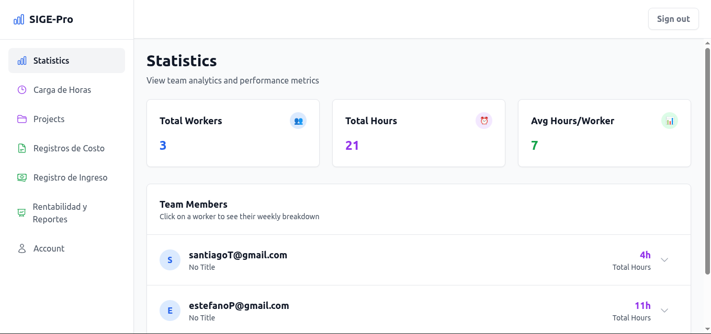
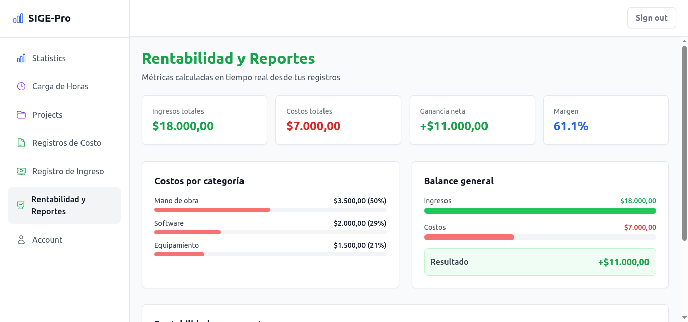

<p align="center">
  
</p>

# SIGE-Pro — Sistema de Gestión de Proyectos

Aplicación web fullstack para gestión interna de equipos: seguimiento de horas, proyectos, costos e ingresos, con reportes de rentabilidad en tiempo real.

## Stack

- **Frontend**: React 19 + TypeScript + Vite + Tailwind CSS
- **Backend**: [Convex](https://convex.dev/) (base de datos reactiva + serverless functions)
- **Autenticación**: Convex Auth
- **UI**: Heroicons, Sonner (toasts)

## Demostración

### Gestión de proyectos


### Rentabilidad y reportes


### Video de demostración
https://github.com/user-attachments/assets/8b00dd29-bcab-4ccc-ab92-d72d31562578

> Muestra el flujo completo de la aplicación: creación de proyectos, carga de horas,
> registro de costos e ingresos, y visualización de métricas de rentabilidad en tiempo real.

## Funcionalidades

- **Carga de horas**: registro semanal de horas trabajadas por proyecto y tarea
- **Gestión de proyectos**: creación, seguimiento de estado y progreso
- **Registros de costo**: categorización de gastos por proyecto (labor, materiales, software, equipamiento)
- **Registros de ingreso**: pagos, milestones e ingresos recurrentes por proyecto
- **Rentabilidad y reportes**: métricas calculadas en tiempo real — ingresos, costos, ganancia neta, margen y desglose por proyecto
- **Estadísticas de equipo**: horas totales y distribución semanal por usuario
- **Autenticación**: registro e inicio de sesión con manejo de sesiones

## Instalación

```bash
# 1. Clonar el repositorio
git clone <repo-url>
cd sige-pro

# 2. Instalar dependencias
npm install

# 3. Configurar Convex (requiere cuenta gratuita en convex.dev)
npx convex dev
```

Convex generará automáticamente las variables de entorno necesarias.

## Correr en local

```bash
npm run dev
```

Esto levanta el frontend (Vite) y el backend (Convex) en paralelo.

## Estructura del proyecto

```
├── convex/              # Backend: schema, queries y mutations
│   ├── schema.ts        # Definición de tablas y tipos
│   ├── projects.ts      # CRUD de proyectos
│   ├── timeEntries.ts   # Registro de horas
│   ├── finances.ts      # Costos, ingresos y rentabilidad
│   └── userProfiles.ts  # Perfiles de usuario
└── src/
    ├── pages/           # Vistas principales
    └── components/      # Sidebar y componentes reutilizables
```

## Arquitectura

El backend corre íntegramente en Convex, que expone queries y mutations tipadas consumidas directamente desde React mediante hooks reactivos (`useQuery`, `useMutation`). No hay API REST manual — los cambios en la base de datos se propagan automáticamente a todos los clientes conectados en tiempo real.
